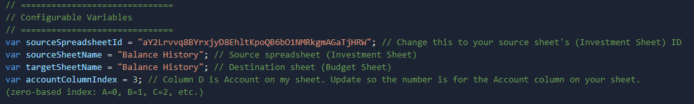
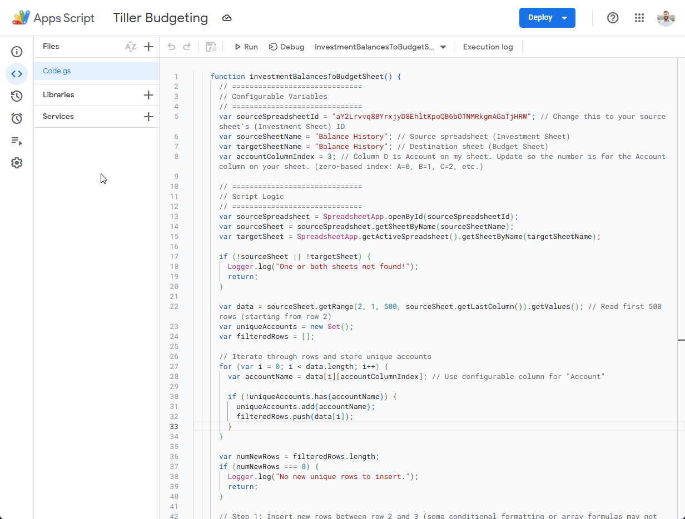
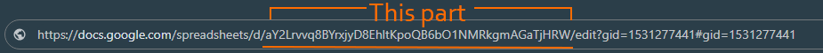

# Daily Balance Import for Tiller Sheets

## Overview
I have 2 Tiller sheets, one for Investments and one for Budgeting. I would like to have the balances of my Investments sheet show up in my Budgeting sheet, but **do not want to add them as accounts**, which would pull in all their transactions and clutter my main Budgeting sheet.

This script fetches just the balances from the Investments sheet **daily** and imports them into the Budgeting sheet.

---

## Installation
It is a Google Apps Script function. Copy and paste the code into any `.gs` file within **Apps Script** from the **Extension** menu in Google Sheets.

---

## Setup

### 1. Set Variables
Update the variables in the script to match your sheet names, range, etc.

### 2. Trigger Daily
Create a daily trigger so the script runs automatically.

---

## Usage
This runs automatically once per day. **No manual actions** are needed after the trigger is set.

---

## Permissions
**Is it okay for others to copy, use, and modify your workflow?**  
Yes! Feel free to use and adapt as needed.

---

## Notes
- Make sure both Balance History sheets have the same columns in the same order.
- **How do I get the ID for my Investment sheet?**  
  It is in the URL bar when you are in that sheet:  
  
