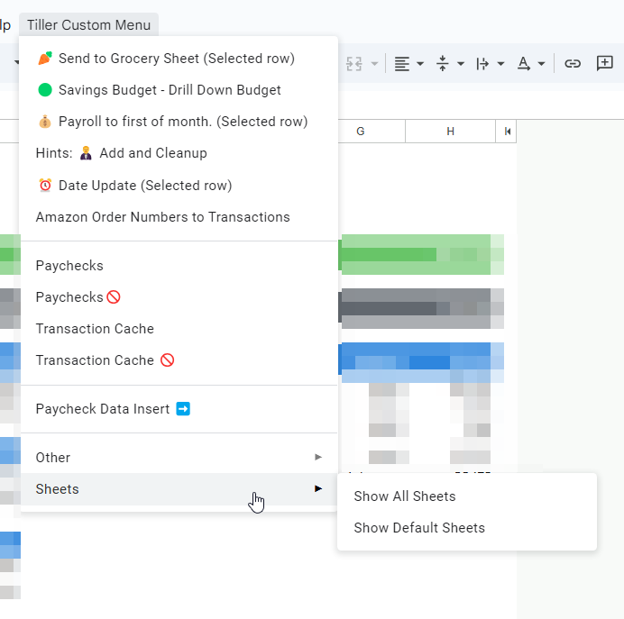

# Tiller Custom UI

## Example

## Description
Make an easy way to call any of your Google Apps Script functions with a custom menu.
Don't forget that you can nest items, or use separators to make it easy to quickly find what you are looking for.

See [UI-CustomMenu.gs](https://github.com/tom01001100/TillerPublic/blob/main/UI-CustomMenu/UI-CustomMenu.gs) for sample code.

More instructions on the [Tiller Community forums](https://community.tillerhq.com/t/custom-ui-menu-with-google-apps-script).

